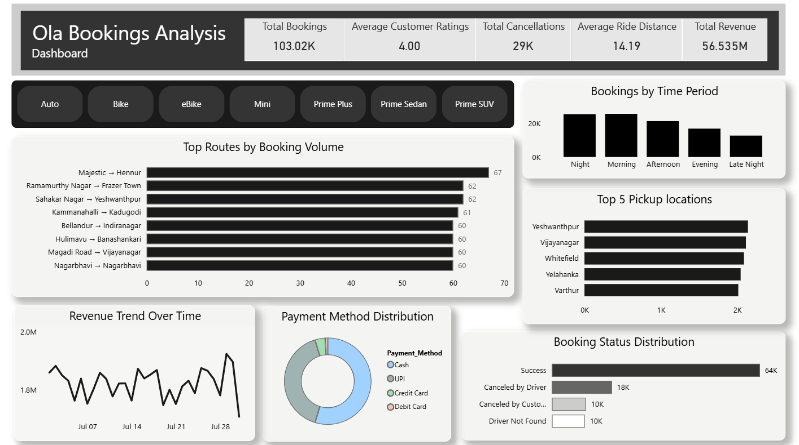

# 🚕 Ola Bookings Analysis — Power BI Dashboard

An interactive **Power BI dashboard** for analyzing Ola booking data, customer behavior, booking patterns, cancellations, routes, payment methods, and revenue trends.

The project analyzes **103K+ booking records** and transforms raw booking data into meaningful business insights through interactive KPIs, filters, and visualizations.

---

## 📊 Dashboard Preview



---

## 🎯 Project Objective

The objective of this project is to analyze Ola booking data and develop an interactive business intelligence dashboard that provides insights into:

* Overall booking and revenue performance
* High-demand pickup locations
* Frequently used routes
* Booking patterns across different time periods
* Booking success and cancellation behavior
* Customer payment preferences
* Revenue trends over time
* Vehicle-type based analysis

---

## 🛠️ Tools & Technologies

* **Power BI** — Dashboard development and data visualization
* **Power Query** — Data cleaning and transformation
* **DAX** — Calculated columns and measures
* **CSV** — Source dataset

---

## 📁 Dataset

The dataset contains **103K+ Ola booking records** with attributes related to bookings, customers, vehicles, locations, payments, cancellations, and revenue.

### Key Attributes

| Attribute              | Description                               |
| ---------------------- | ----------------------------------------- |
| `Booking_ID`           | Unique identifier for each booking        |
| `Booking_Status`       | Status of the booking                     |
| `Vehicle_Type`         | Type of vehicle selected                  |
| `Pickup_Location`      | Location where the ride starts            |
| `Drop_Location`        | Destination of the ride                   |
| `Booking_Value`        | Monetary value of the booking             |
| `Payment_Method`       | Payment method used                       |
| `Ride_Distance`        | Distance travelled                        |
| `Time`                 | Booking time                              |
| `Customer_Rating`      | Rating provided by the customer           |
| `Cancellation Details` | Information related to cancelled bookings |

---

## 📈 Dashboard Features

### 1. KPI Overview

The dashboard provides five key performance indicators:

* **Total Bookings:** 103.02K
* **Average Customer Rating:** 4.00
* **Total Cancellations:** 29K
* **Average Ride Distance:** 14.19 km
* **Total Revenue:** ₹56.535M

These KPIs provide a quick overview of the overall booking and revenue performance.

---

### 2. 🚗 Vehicle Type Filter

An interactive vehicle-type slicer allows users to filter the dashboard by:

* Auto
* Bike
* eBike
* Mini
* Prime Plus
* Prime Sedan
* Prime SUV

The selected vehicle type dynamically filters the dashboard visualizations.

---

### 3. 🛣️ Top Routes by Booking Volume

A horizontal bar chart identifies the routes with the highest booking volume.

Routes are created using:

**Pickup Location → Drop Location**

The visualization helps identify frequently used travel routes.

---

### 4. 📍 Top 5 Pickup Locations

This visualization identifies the pickup locations with the highest number of bookings.

It helps identify areas with consistently high booking demand.

---

### 5. 🕐 Bookings by Time Period

Bookings are grouped into five time periods:

* Night
* Morning
* Afternoon
* Evening
* Late Night

This provides a broader view of booking demand throughout the day.

---

### 6. 💳 Payment Method Distribution

A donut chart shows the distribution of payment methods for completed rides.

Payment methods include:

* Cash
* UPI
* Credit Card
* Debit Card

Cancelled rides are excluded because no payment is processed when a ride does not start.

---

### 7. 📋 Booking Status Distribution

The dashboard analyzes booking outcomes across:

* Success
* Cancelled by Driver
* Cancelled by Customer
* Driver Not Found

This provides insight into successful rides and booking losses due to cancellations or driver availability.

---

### 8. 💰 Revenue Trend Over Time

A line chart tracks revenue over time to identify fluctuations and changes in revenue performance.

---

## 🔄 Data Preparation

The dataset was cleaned and transformed before visualization.

Key preparation steps included:

* Handling missing and invalid values
* Standardizing categorical fields
* Preparing booking-status categories
* Creating time-based attributes
* Creating a combined **Route** field
* Creating **Time Period** classifications
* Validating numerical fields
* Preparing the dataset for Power BI analysis

### Example DAX Calculations

#### Route

```DAX
Route =
'Bookings_Cleaned'[Pickup_Location]
& " → " &
'Bookings_Cleaned'[Drop_Location]
```

#### Time Period

```DAX
Time Period =
SWITCH(
    TRUE(),
    'Bookings_Cleaned'[Booking Hour] < 6, "Night",
    'Bookings_Cleaned'[Booking Hour] < 12, "Morning",
    'Bookings_Cleaned'[Booking Hour] < 17, "Afternoon",
    'Bookings_Cleaned'[Booking Hour] < 21, "Evening",
    "Late Night"
)
```

#### Time Period Sort

```DAX
Time Period Sort =
SWITCH(
    TRUE(),
    'Bookings_Cleaned'[Booking Hour] < 6, 1,
    'Bookings_Cleaned'[Booking Hour] < 12, 2,
    'Bookings_Cleaned'[Booking Hour] < 17, 3,
    'Bookings_Cleaned'[Booking Hour] < 21, 4,
    5
)
```

---

## 🔍 Key Insights

The dashboard highlights several observations from the dataset:

* More than **103K bookings** were analyzed.
* The overall **average customer rating is 4.00**.
* Total revenue generated is approximately **₹56.5M**.
* Successful bookings represent the largest booking-status category.
* Cancellations account for a significant portion of total bookings.
* **Yeshwanthpur, Vijayanagar, Whitefield, Yelahanka, and Varthur** are among the highest-volume pickup locations.
* Booking activity is relatively higher during the **Night and Morning** periods.
* Several routes have similar booking volumes, with multiple routes tied at the same booking count.
* **Cash and UPI** represent the major payment methods among completed rides.
* Revenue shows noticeable fluctuations throughout the analyzed period.

---

## 🎨 Dashboard Design

The dashboard follows a minimal **black, white, and grey** visual theme.

### Design Principles

* KPI-first information hierarchy
* Interactive vehicle-type filtering
* Horizontal bar charts for categorical comparisons
* Donut chart for payment distribution
* Line chart for revenue trends
* Consistent typography and spacing
* Minimal visual clutter
* Business-focused visualization titles

---

## 📂 Project Structure

```text
Ola-Bookings-Analysis/
│
├── README.md
├── Bookings_Cleaned.csv
├── Ola_Bookings_Analysis.pbix
└── dashboard.png
```

> Update the filenames above if your repository uses different filenames.

---

## 🚀 How to Use

1. Clone or download the repository.
2. Open `Ola_Bookings_Analysis.pbix` using **Microsoft Power BI Desktop**.
3. If required, update the dataset path in Power Query.
4. Refresh the dataset.
5. Use the **Vehicle Type** buttons to filter the dashboard.
6. Explore the visualizations to analyze booking, route, payment, cancellation, and revenue patterns.

---

## 💡 Business Questions Answered

This dashboard helps answer questions such as:

* How many bookings were made?
* How much revenue was generated?
* Which pickup locations have the highest demand?
* Which routes have the highest booking volume?
* During which time periods are bookings most frequent?
* Which payment methods are most commonly used?
* What percentage of bookings are successful or cancelled?
* How significant are cancellations?
* How does revenue change over time?
* How does vehicle selection affect booking and revenue analysis?

---

## 🔮 Future Improvements

Potential extensions include:

* Cancellation-rate analysis by location
* Revenue analysis by route
* Customer segmentation
* Repeat-customer analysis
* Geographic heatmaps
* Revenue and booking forecasting
* Advanced vehicle-level performance analysis
* Dynamic report tooltips
* Additional drill-through pages

---

## 👨‍💻 Author

### **Shreyans Jain H**

**B.Tech — Computer Science & Engineering**
**Specialization: Big Data Analytics**

### Skills Demonstrated

`Power BI` · `DAX` · `Power Query` · `Data Cleaning` · `Data Analysis` · `Data Visualization` · `Business Intelligence` · `Dashboard Design`

---

## ⭐ If you found this project useful

Consider giving the repository a **star** ⭐
